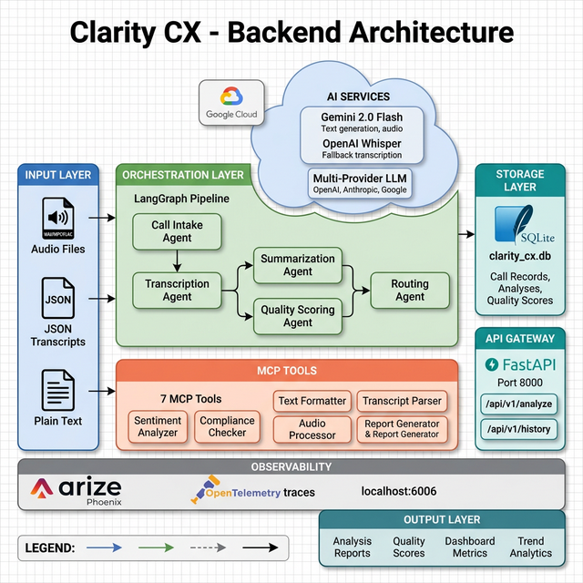

# 📞 Clarity CX

### AI-Powered Call Center Intelligence Platform

> Transform call center recordings and transcripts into structured summaries, quality scores, and actionable insights.



---

## 🚀 Quick Start

```bash
# 1. Clone & install
git clone <repo-url> clarity-cx && cd clarity-cx
uv venv && source venv/bin/activate
uv pip install -r requirements.txt

# 2. Configure
cp .env.example .env
# Edit .env → add GOOGLE_API_KEY (minimum)

# 3. Seed sample data (optional)
python scripts/seed_database.py

# 4. Run
streamlit run src/ui/app.py
```

📖 **See [docs/QUICKSTART.md](docs/QUICKSTART.md) for the full setup guide.**

---

## 🤖 Five Specialist Agents

| Agent | Role | Key Feature |
|-------|------|-------------|
| 📥 **Intake** | Input validation & metadata extraction | Auto-detects agent names |
| 🎙️ **Transcription** | Audio→Text conversion | Gemini 2.0 Flash + Whisper fallback |
| 📝 **Summarization** | LLM-powered call summaries | Key points, action items, intent |
| 📊 **Quality Scoring** | 5-dimension quality assessment | Empathy, Resolution, Professionalism, Compliance, Efficiency |
| 🔀 **Routing** | Report assembly & error recovery | Graceful degradation for partial failures |

All orchestrated via **LangGraph** state machine with parallel processing.

---

## 🖥️ Five-Tab UI

| Tab | Purpose |
|-----|---------|
| 📊 **Dashboard** | Live metrics, score distribution, recent calls with filter/sort |
| 🎙️ **Analyze Call** | Upload audio, paste transcript, or select from 20 samples |
| 📋 **Call History** | Browse all analyzed calls with search and score filtering |
| 📈 **Trends** | Quality trends over time, dimension averages, top topics |
| ⚙️ **Settings** | LLM provider and model configuration |

---

## 🛠️ Technology Stack

| Category | Technology |
|----------|------------|
| Frontend | Streamlit, Plotly, Custom CSS |
| Backend | FastAPI, LangGraph, MCP (7 tools) |
| LLMs | Gemini 2.0 Flash, GPT-4o, Claude |
| Transcription | Gemini 2.0 Flash (primary), Whisper (fallback) |
| Database | SQLite |
| Observability | Arize Phoenix + OpenTelemetry |
| Evaluations | Phoenix LLM-as-Judge (7 metrics) |
| Testing | pytest (26 tests) |
| Deployment | Google Cloud Run (source deploy) |

---

## 📚 Documentation

| Document | Description |
|----------|-------------|
| [Quick Start](docs/QUICKSTART.md) | 5-minute setup guide |
| [Architecture](docs/ARCHITECTURE.md) | System architecture with diagrams |
| [Code Walkthrough](docs/CODE_WALKTHROUGH.md) | Every module explained |
| [Deployment](docs/DEPLOYMENT.md) | Google Cloud Run guide |
| [Submission Guide](SUBMISSION_GUIDE.md) | Evaluator submission guide |
| [Technical Spec](SPEC_DEV.md) | Full technical specification |
| [Roadmap](ROADMAP.md) | Development timeline |

---

## 🧪 Testing

```bash
python -m pytest tests/ -v
# 26 tests — agents, models, PII detection, compliance, database, samples
```

---

## 🎯 Try It Out — Evaluator Guide

### Option 1: Paste a Transcript

1. Open the app → **Analyze Call** tab → select **📝 Paste Transcript**
2. Copy the contents of [`data/sample_transcripts/demo_transcript.txt`](data/sample_transcripts/demo_transcript.txt) and paste into the text box
3. Click **🚀 Analyze Call**
4. View the generated summary, quality scores (radar chart), and action items

### Option 2: Upload Audio

1. Open the app → **Analyze Call** tab → select **📤 Upload Audio**
2. Upload the file [`data/sample_audio/demo_call.mp3`](data/sample_audio/demo_call.mp3)
3. Click **🚀 Analyze Call** — Gemini will transcribe the audio and run the full pipeline
4. View the generated transcript, summary, and quality assessment

### Option 3: Use Pre-Loaded Samples

1. Open the app → **Analyze Call** tab → select **📁 Sample Transcript**
2. Choose any of the 20 pre-loaded e-commerce call scenarios
3. Click **🚀 Analyze Call**

> **Dashboard & History:** After analyzing a call, switch to the **Dashboard** or **Call History** tab to see the newly added call alongside the 20 auto-seeded sample records.

---

## 📦 Deployment

```bash
# Deploy to Google Cloud Run (no Docker install needed)
gcloud run deploy clarity-cx --source . --region us-central1 --port 8501
```

The app **auto-seeds the database** with 20 sample calls on first launch.

📖 **See [docs/DEPLOYMENT.md](docs/DEPLOYMENT.md) for the full deployment guide.**

---

## 📄 License

MIT
