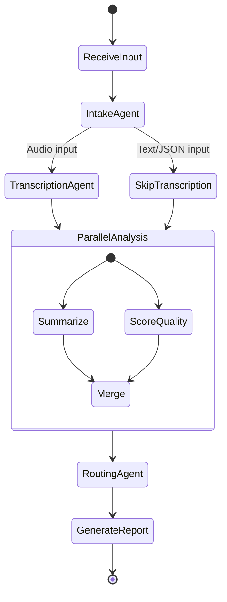

# Clarity CX — Execution Roadmap
## From Architecture to Deployed Application

> **Version:** 1.0.0  
> **Last Updated:** February 22, 2026  
> **Presentation:** February 22, 2026  
> **Submission:** March 1, 2026 (7 days)  
> **Companion Docs:** [SPEC_DEV.md](./SPEC_DEV.md) | [Architecture](./docs/ARCHITECTURE.md)

---

## Executive Timeline

```mermaid
gantt
    title Clarity CX Development Roadmap (7 Days)
    dateFormat  YYYY-MM-DD
    
    section Phase 1: Core Pipeline
    Project Setup & Structure        :p1a, 2026-02-22, 1d
    LangGraph Orchestration          :p1b, 2026-02-22, 2d
    Core Agents (5 agents)           :p1c, 2026-02-23, 2d
    Cloud LLM Integration            :p1d, 2026-02-23, 1d
    MCP Tool Servers                 :p1e, 2026-02-24, 1d
    
    section Phase 2: UI/UX
    Streamlit Multi-Tab UI           :p2a, 2026-02-24, 2d
    Responsive Mobile CSS            :p2b, 2026-02-25, 1d
    Sample Transcripts Data          :p2c, 2026-02-25, 1d
    
    section Phase 3: Features
    Whisper Transcription            :p3a, 2026-02-25, 1d
    Quality Scoring Engine           :p3b, 2026-02-26, 1d
    Sentiment Analysis               :p3c, 2026-02-26, 1d
    PII Detection & Redaction        :p3d, 2026-02-26, 1d
    Analytics Dashboard              :p3e, 2026-02-27, 1d
    
    section Phase 4: Polish
    Arize Phoenix Observability       :p4a, 2026-02-27, 1d
    DeepEval Evaluations             :p4b, 2026-02-27, 1d
    Call History & Search            :p4c, 2026-02-28, 1d
    
    section Phase 5: Deploy
    Google Cloud Run Deployment      :p5a, 2026-02-28, 1d
    Testing & Bug Fixes              :p5b, 2026-02-28, 2d
    Documentation                    :p5c, 2026-03-01, 1d
    🚀 SUBMISSION                    :milestone, m2, 2026-03-01, 0d
```

---

## Quick Reference: What's In vs What's Deferred

### ✅ IN SCOPE (Days 1–7)

| Feature | Status | Phase |
|---------|--------|-------|
| LangGraph state machine | 🔲 Planned | 1 |
| 5 specialized agents | 🔲 Planned | 1 |
| MCP tool integration (7 tools) | 🔲 Planned | 1 |
| Multi-provider LLM (OpenAI/Anthropic/Google) | 🔲 Planned | 1 |
| Streamlit multi-tab UI (5 tabs) | 🔲 Planned | 2 |
| Responsive mobile design | 🔲 Planned | 2 |
| Whisper audio transcription | 🔲 Planned | 3 |
| Quality scoring (5 dimensions) | 🔲 Planned | 3 |
| Sentiment trajectory analysis | 🔲 Planned | 3 |
| PII detection & redaction | 🔲 Planned | 3 |
| Analytics dashboard | 🔲 Planned | 3 |
| Arize Phoenix observability | 🟢 Done | 4 |
| DeepEval evaluations | 🔲 Planned | 4 |
| Docker deployment | 🔲 Planned | 5 |
| Google Cloud Run deployment | 🔲 Planned | 5 |
| FastAPI REST API | 🔲 Planned | 5 |
| 10–15 sample call transcripts | 🔲 Planned | 2 |

### ⏭️ DEFERRED (Post-Submission)

| Feature | Reason | When |
|---------|--------|------|
| Real-time call analysis | Requires streaming pipeline | Week 3 |
| CRM integration (Salesforce/Zendesk) | API complexity | Week 3 |
| Custom fine-tuned scoring model | Time-intensive | Week 4 |
| Multi-language support | Additional complexity | Week 4 |
| Agent coaching recommendations engine | ML model training | Week 5 |
| Native mobile app | PWA sufficient for now | Week 6+ |

---

## Phase 1: Core Pipeline (Days 1–2)
**Goal:** Working call analysis pipeline with LangGraph orchestration

### 1.1 Project Setup (Day 1 Morning)

```
clarity-cx/
├── src/
│   ├── agents/
│   │   ├── __init__.py
│   │   ├── base_agent.py
│   │   ├── intake_agent.py
│   │   ├── transcription_agent.py
│   │   ├── summarization_agent.py
│   │   ├── quality_score_agent.py
│   │   └── routing_agent.py
│   ├── orchestration/
│   │   ├── __init__.py
│   │   ├── state.py
│   │   ├── graph.py
│   │   └── nodes.py
│   ├── mcp/
│   │   ├── __init__.py
│   │   ├── server.py
│   │   └── tools/
│   │       ├── audio_tools.py
│   │       ├── analysis_tools.py
│   │       └── qa_tools.py
│   ├── llm/
│   │   ├── __init__.py
│   │   ├── adapter.py
│   │   └── providers/
│   │       ├── openai_provider.py
│   │       ├── anthropic_provider.py
│   │       └── google_provider.py
│   ├── api/
│   │   ├── __init__.py
│   │   ├── main.py
│   │   └── routes/
│   └── ui/
│       ├── app.py
│       ├── pages/
│       └── components/
├── data/
│   └── sample_transcripts/
├── docs/
│   ├── ARCHITECTURE.md
│   └── presentation.html
├── tests/
├── config/
│   └── mcp.yaml
├── SPEC_DEV.md
├── ROADMAP.md
├── requirements.txt
├── pyproject.toml
├── Dockerfile
├── docker-compose.yml
└── .env.example
```

#### Tasks

- [ ] Initialize Python project with `pyproject.toml`
- [ ] Create directory structure
- [ ] Set up dependencies in `requirements.txt`
- [ ] Create `.env.example` with all required variables
- [ ] Set up basic Docker configuration

---

### 1.2 LangGraph Orchestration (Days 1–2)



#### Tasks

- [ ] Define `ClarityState` TypedDict
- [ ] Create node functions for each agent
- [ ] Build supervisor node with input type detection
- [ ] Implement parallel analysis execution (summary + quality)
- [ ] Create state aggregation logic
- [ ] Add streaming response handling
- [ ] Set up call context memory

#### Key Code Pattern

```python
# src/orchestration/state.py
from typing import TypedDict, Annotated, List, Optional
from operator import add

class ClarityState(TypedDict):
    # Input
    input_type: str           # 'audio', 'transcript', 'text'
    input_path: str
    session_id: str

    # LLM Config
    llm_provider: str
    llm_model: str

    # Agent outputs (accumulated via reducer)
    agent_outputs: Annotated[List[dict], add]

    # Pipeline data
    call_metadata: Optional[dict]
    transcript: Optional[str]
    summary: Optional[dict]
    quality_scores: Optional[dict]

    # Final output
    final_report: dict
    error_log: List[str]
```

```python
# src/orchestration/graph.py
from langgraph.graph import StateGraph, END
from .state import ClarityState

def create_graph():
    workflow = StateGraph(ClarityState)

    # Add nodes
    workflow.add_node("intake", intake_node)
    workflow.add_node("transcribe", transcription_node)
    workflow.add_node("summarize", summarization_node)
    workflow.add_node("score_quality", quality_scoring_node)
    workflow.add_node("route", routing_node)
    workflow.add_node("report", report_generation_node)

    # Set entry
    workflow.set_entry_point("intake")

    # Conditional: skip transcription for text/JSON
    workflow.add_conditional_edges(
        "intake",
        route_by_input_type,
        {
            "audio": "transcribe",
            "text": "summarize",
        }
    )

    workflow.add_edge("transcribe", "summarize")
    # Parallel: summarize + score run together
    workflow.add_edge("summarize", "score_quality")
    workflow.add_edge("score_quality", "route")
    workflow.add_edge("route", "report")
    workflow.add_edge("report", END)

    return workflow.compile()
```

---

### 1.3 Core Agents (Days 2–3)

#### Implementation Order

1. **Call Intake Agent** (first — validates everything)
2. **Transcription Agent** (second — produces text)
3. **Summarization Agent** (third — core value)
4. **Quality Scoring Agent** (fourth — rubric eval)
5. **Routing Agent** (last — error handling)

#### Agent Template

```python
# src/agents/base_agent.py
from abc import ABC, abstractmethod
from typing import Dict, Any, List
from pydantic import BaseModel

class BaseClarityAgent(ABC):
    name: str
    description: str
    system_prompt: str

    @abstractmethod
    async def process(self, state: Dict[str, Any]) -> Dict[str, Any]:
        """Process state and return updates"""
        pass
```

```python
# src/agents/summarization_agent.py
from .base_agent import BaseClarityAgent
from pydantic import BaseModel
from typing import List

class CallSummary(BaseModel):
    summary: str
    key_points: List[str]
    action_items: List[str]
    customer_intent: str
    resolution_status: str
    topics: List[str]
    sentiment_trajectory: str

class SummarizationAgent(BaseClarityAgent):
    name = "Summarization Agent"
    description = "Generates structured call summaries"

    system_prompt = """
    You are a call center summarization expert. Given a call transcript:
    1. Write a concise 2-3 sentence summary
    2. Extract 3-5 key points as bullet items
    3. Identify action items requiring follow-up
    4. Determine the customer's primary intent
    5. Classify resolution status: resolved / escalated / pending
    6. Tag relevant topics: billing, shipping, returns, technical, etc.
    7. Describe sentiment trajectory through the call

    Return structured JSON matching the CallSummary schema.
    """

    async def process(self, state):
        # Use LLM with function calling to generate structured summary
        # Parse into Pydantic model
        # Return state update
        pass
```

---

### 1.4 MCP Tool Servers (Day 2)

#### Tasks

- [ ] Create MCP server base
- [ ] Implement audio tools (Whisper wrapper)
- [ ] Implement analysis tools (summary, sentiment)
- [ ] Implement QA tools (scoring, PII detection)
- [ ] Add tool discovery endpoint
- [ ] Connect to LangGraph agents

#### Tool Implementations

```python
# src/mcp/tools/audio_tools.py
import openai
from typing import Dict, Any

async def transcribe_audio(audio_path: str, language: str = "en") -> Dict[str, Any]:
    """Transcribe audio file using Whisper API"""
    with open(audio_path, "rb") as audio_file:
        response = openai.audio.transcriptions.create(
            model="whisper-1",
            file=audio_file,
            language=language,
            response_format="verbose_json",
            timestamp_granularities=["segment"]
        )

    return {
        "transcript": response.text,
        "segments": [
            {
                "start": seg.start,
                "end": seg.end,
                "text": seg.text
            }
            for seg in response.segments
        ],
        "language": response.language,
        "duration": response.duration
    }
```

```python
# src/mcp/tools/qa_tools.py
import re
from typing import Dict, List

async def detect_pii(text: str) -> Dict[str, Any]:
    """Detect PII in transcript text"""
    patterns = {
        "ssn": r'\b\d{3}-\d{2}-\d{4}\b',
        "credit_card": r'\b\d{4}[\s-]?\d{4}[\s-]?\d{4}[\s-]?\d{4}\b',
        "phone": r'\b\d{3}[-.]?\d{3}[-.]?\d{4}\b',
        "email": r'\b[A-Za-z0-9._%+-]+@[A-Za-z0-9.-]+\.[A-Z|a-z]{2,}\b'
    }

    detected = []
    for pii_type, pattern in patterns.items():
        matches = re.findall(pattern, text)
        if matches:
            detected.append({
                "type": pii_type,
                "count": len(matches),
                "locations": [m.start() for m in re.finditer(pattern, text)]
            })

    return {
        "pii_found": len(detected) > 0,
        "detections": detected,
        "risk_level": "high" if any(d["type"] in ["ssn", "credit_card"] for d in detected) else "low"
    }
```

---

### 1.5 LLM Provider Integration (Day 2)

Same adapter pattern as Finnie AI — see [SPEC_DEV.md Section 10](./SPEC_DEV.md#10-llm-provider-configuration).

---

## Phase 2: UI/UX (Days 3–4)
**Goal:** Multi-tab responsive interface with call upload and analysis display

### 2.1 Streamlit Multi-Tab UI

```python
# src/ui/app.py
import streamlit as st

st.set_page_config(
    page_title="Clarity CX",
    page_icon="📞",
    layout="wide",
    initial_sidebar_state="collapsed"
)

# Header
st.markdown("# 📞 Clarity CX")

# Tab navigation
tab_dashboard, tab_analyze, tab_history, tab_trends, tab_settings = st.tabs([
    "📊 Dashboard",
    "🎙️ Analyze Call",
    "📋 Call History",
    "📈 Trends",
    "⚙️ Settings"
])
```

### 2.2 Sample Transcripts

Create 10–15 sample call transcripts covering diverse scenarios:

| # | Scenario | Sentiment | Expected Score |
|---|----------|-----------|----------------|
| 1 | Order delay inquiry | Neg → Pos | 8.0 |
| 2 | Billing dispute | Negative | 5.5 |
| 3 | Product return | Neutral | 7.0 |
| 4 | Technical support | Mixed | 6.5 |
| 5 | Account cancellation | Neg → Neutral | 7.5 |
| 6 | Upgrade inquiry | Positive | 9.0 |
| 7 | Complaint escalation | Very Negative | 3.5 |
| 8 | Payment issue | Neg → Pos | 7.0 |
| 9 | General inquiry | Neutral | 8.5 |
| 10 | Emergency support | Urgent → Resolved | 8.0 |

### 2.3 Responsive Design

- Mobile-first CSS with breakpoints at 768px and 1024px
- Touch-friendly upload area
- Stacked cards on mobile, side-by-side on desktop
- Collapsible transcript sections

---

## Phase 3: Features (Days 4–5)
**Goal:** Full analysis pipeline with all scoring dimensions

### 3.1 Quality Scoring Engine

#### Tasks

- [ ] Implement 5-dimension scoring rubric
- [ ] Create Pydantic models for structured output
- [ ] Add score visualization (radar chart)
- [ ] Implement score bands (🟢🟡🟠🔴)
- [ ] Generate coaching recommendations

### 3.2 Sentiment Analysis

#### Tasks

- [ ] Implement per-turn sentiment scoring
- [ ] Create sentiment timeline chart
- [ ] Detect sentiment inflection points
- [ ] Generate sentiment trajectory label

### 3.3 PII Detection

#### Tasks

- [ ] Implement regex-based PII detector
- [ ] Add NER-based name detection
- [ ] Create PII redaction toggle
- [ ] Flag calls with PII exposure

### 3.4 Analytics Dashboard

#### Tasks

- [ ] Aggregate scores across call history
- [ ] Create trend charts (7-day, 30-day)
- [ ] Show score distribution histogram
- [ ] Highlight calls requiring attention
- [ ] Display key metrics cards (total calls, avg score, resolution rate)

---

## Phase 4: Polish (Days 5–6)
**Goal:** Observability, evaluation, and search

### 4.1 Arize Phoenix Observability

#### Tasks

- [ ] Add `@trace` decorators to all agents
- [ ] Track latency per pipeline stage
- [ ] Monitor token usage and cost
- [ ] Set up alerting for high error rates

### 4.2 DeepEval Evaluations

#### Tasks

- [ ] Implement answer relevancy metric
- [ ] Implement faithfulness metric
- [ ] Implement hallucination detection
- [ ] Create evaluation test suite with sample transcripts

---

## Phase 5: Deploy (Days 6–7)
**Goal:** Docker deployment to Google Cloud Run

### 5.1 Deployment

#### Tasks

- [ ] Create `Dockerfile` with ffmpeg for audio support
- [ ] Create `docker-compose.yml`
- [ ] Deploy to Google Cloud Run
- [ ] Set up environment variables
- [ ] Test end-to-end on deployed instance

### 5.2 Testing

#### Tasks

- [ ] Unit tests for each agent
- [ ] Integration test for full pipeline
- [ ] UI smoke tests
- [ ] DeepEval evaluation suite
- [ ] Performance benchmarks

### 5.3 Documentation

#### Tasks

- [ ] Update README.md
- [ ] Create PROMPT_JOURNAL.md
- [ ] Create TEST_GUIDE.md
- [ ] Record demo video
- [ ] Final review of all docs

---

## Appendix: Key Decisions

| Decision | Choice | Rationale |
|----------|--------|-----------|
| Orchestration | LangGraph over CrewAI | Better state management, conditional routing |
| UI | Streamlit over Gradio | Rich widgets, rapid development, responsive |
| Database | SQLite over PostgreSQL | Zero-config for MVP, easy migration later |
| Transcription | Whisper over Deepgram | Same-vendor integration with OpenAI |
| Scoring | Function calling over prompts | Structured Pydantic output, reliable |
| Deployment | Cloud Run over Railway | GCP integration, free tier |

---

*See [SPEC_DEV.md](./SPEC_DEV.md) for detailed technical specifications.*
