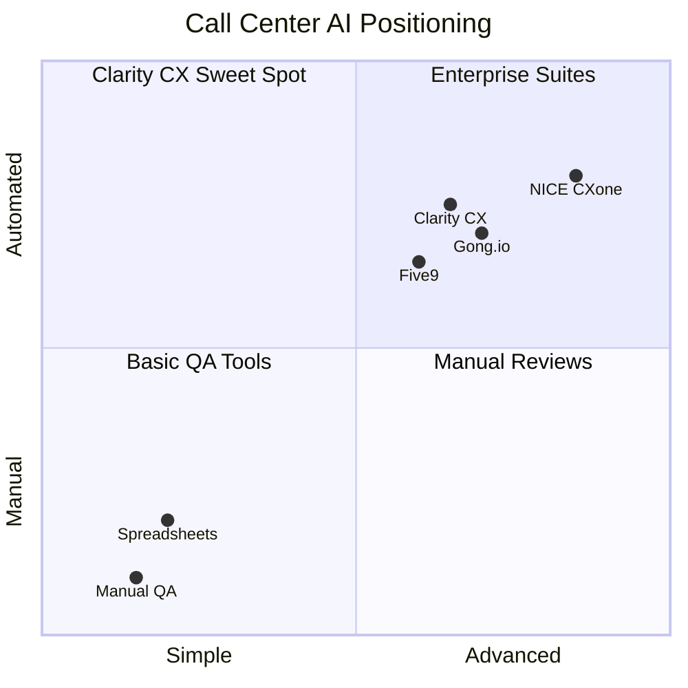
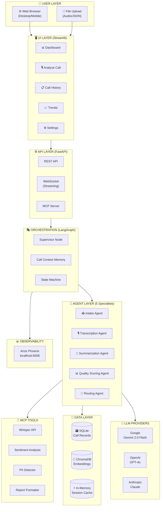
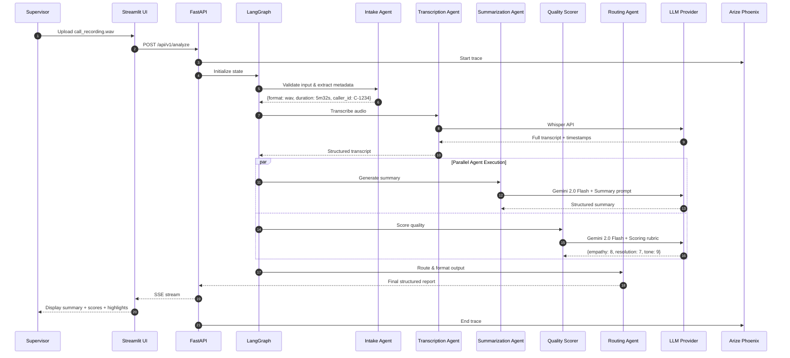
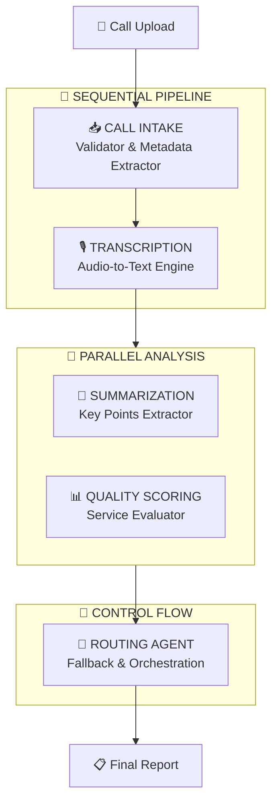
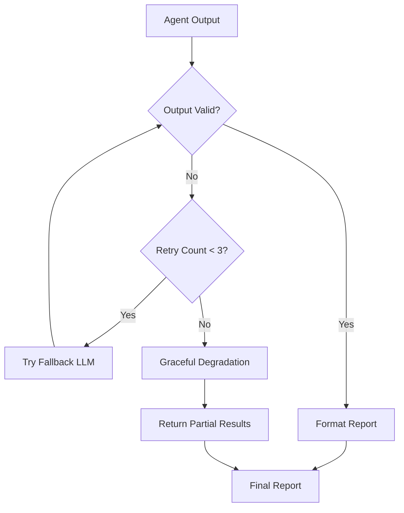
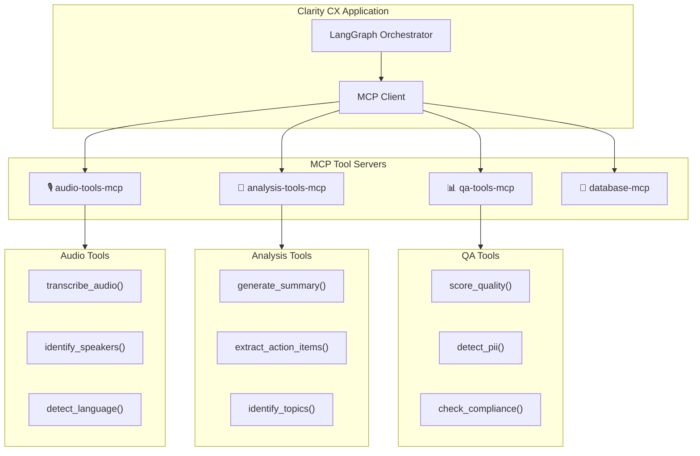
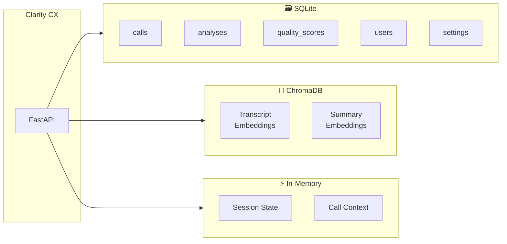
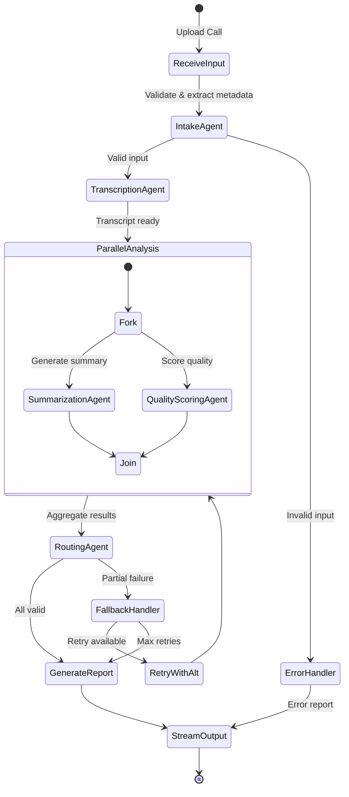
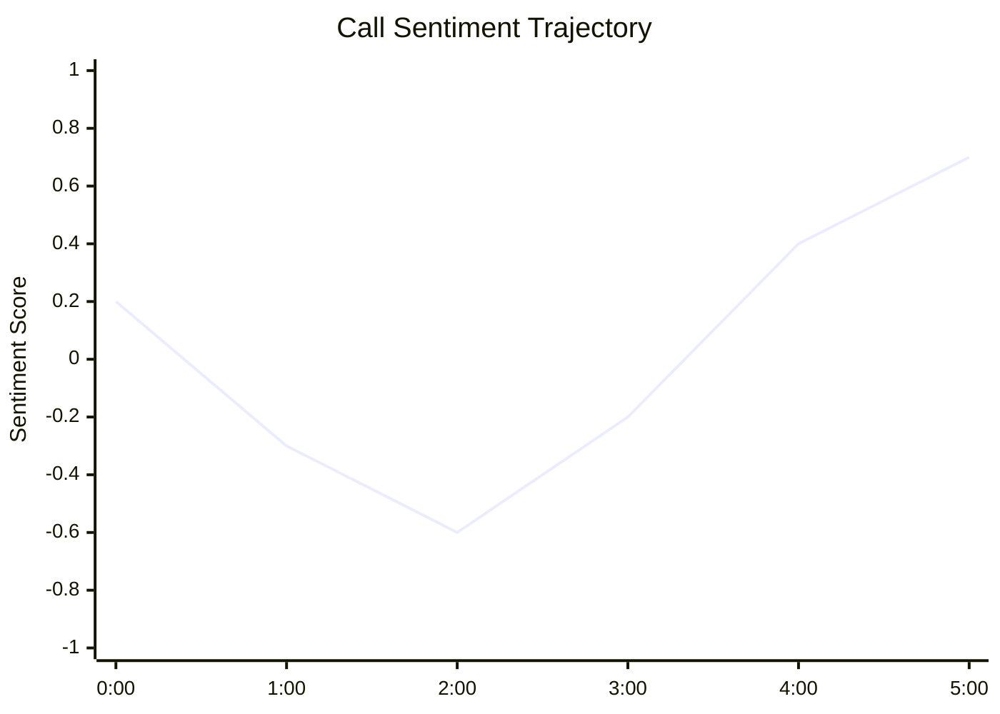
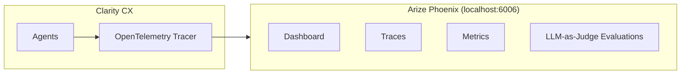

# Clarity CX — Technical Specification Document
## AI-Powered Call Center Intelligence Platform

> **Codename:** "Contact Center Brain"  
> **Version:** 1.0.0  
> **Last Updated:** February 22, 2026  
> **Author:** Principal AI Architect  
> **Companion Docs:** [ROADMAP.md](./ROADMAP.md) | [Architecture](./docs/ARCHITECTURE.md)

---

## Table of Contents

1. [Executive Summary](#1-executive-summary)
2. [System Architecture](#2-system-architecture)
3. [Agent Roster — The Five Specialists](#3-agent-roster--the-five-specialists)
4. [MCP & A2A Integration](#4-mcp--a2a-integration)
5. [Data Layer Architecture](#5-data-layer-architecture)
6. [LangGraph Orchestration](#6-langgraph-orchestration)
7. [Feature Specifications](#7-feature-specifications)
8. [UI/UX Design](#8-uiux-design)
9. [Technology Stack](#9-technology-stack)
10. [LLM Provider Configuration](#10-llm-provider-configuration)
11. [Observability & Monitoring](#11-observability--monitoring)
12. [Deployment Architecture](#12-deployment-architecture)
13. [Security & Compliance](#13-security--compliance)
14. [Scoring Matrix Alignment](#14-scoring-matrix-alignment)

---

## 1. Executive Summary

### 1.1 Vision

**Clarity CX** is an **AI-Powered Call Center Intelligence Platform** — a multi-agent system that transforms raw call center recordings and transcripts into structured summaries, quality scores, and actionable insights, enabling supervisors to monitor service quality at scale.

### 1.2 What Clarity CX Does

| Capability | Description | Comparison |
|------------|-------------|------------|
| **🎙️ Audio Transcription** | Converts call recordings to text using Whisper | Like Rev.com, AI-powered |
| **📝 Call Summarization** | Generates structured summaries with key points | Like Gong.io, simplified |
| **📊 Quality Scoring** | Evaluates empathy, resolution, tone, compliance | Like NICE CX, AI-scored |
| **🔀 Smart Routing** | Routes calls based on complexity and model output | Like Five9, intelligent |
| **📈 Analytics Dashboard** | Aggregates trends, agent performance metrics | Like Genesys, streamlined |
| **🔍 Compliance Monitoring** | Flags PII, detects script deviations | Like Verint, automated |

### 1.3 What Clarity CX Does NOT Do

> [!IMPORTANT]
> Clarity CX is an **analytical and monitoring tool**, NOT a live call handler.

- ❌ **No Live Call Handling** — Post-call analysis only (MVP)
- ❌ **No Agent Coaching in Real-Time** — Provides retrospective feedback
- ❌ **No CRM Integration** — Standalone analytical tool (MVP)
- ❌ **No Customer PII Storage** — Anonymizes all transcript data

### 1.4 Competitive Positioning



### 1.5 Milestone Timeline

| Milestone | Date | Deliverables |
|-----------|------|--------------|
| 🎯 **Presentation** | Feb 22, 2026 | Architecture, UI mocks, demo flows |
| 🚀 **Submission** | Mar 1, 2026 | Working app, deployed to Cloud, docs |
| 🔧 **Enhancement** | Post-submission | Real-time analysis, CRM integrations |

---

## 2. System Architecture

### 2.1 High-Level Architecture (MVP)



### 2.2 Request Flow Sequence



---

## 3. Agent Roster — The Five Specialists

### 3.1 Agent Overview



### 3.2 Detailed Agent Specifications

#### 📥 Call Intake Agent — Validator & Metadata Extractor

| Attribute | Value |
|-----------|-------|
| **Primary Function** | Validate input formats, extract call metadata |
| **MCP Tools** | `validate_audio`, `extract_metadata`, `detect_format` |
| **Input Formats** | WAV, MP3, FLAC, JSON transcript, plain text |
| **Output** | Validation status, metadata (duration, format, size, caller ID) |

**Validation Rules:**
- Audio: Max 30min, supported codec, min quality threshold
- Transcript: Valid JSON schema, required fields present
- Text: Min 100 chars, language detection

**Example Output:**
```json
{
    "status": "valid",
    "format": "audio/wav",
    "duration_seconds": 332,
    "file_size_mb": 5.2,
    "language": "en",
    "caller_id": "C-2024-1234",
    "agent_id": "A-0567",
    "timestamp": "2026-02-22T14:30:00Z"
}
```

---

#### 🎙️ Transcription Agent — Audio-to-Text Engine

| Attribute | Value |
|-----------|-------|
| **Primary Function** | Convert audio to text with speaker diarization |
| **MCP Tools** | `transcribe_audio`, `identify_speakers`, `detect_language` |
| **Primary Tech** | OpenAI Whisper API |
| **Alternatives** | Deepgram, AssemblyAI |
| **Output** | Timestamped, speaker-labeled transcript |

**Output Format:**
```json
{
    "transcript": [
        {
            "speaker": "Agent",
            "timestamp": "00:00:05",
            "text": "Thank you for calling Acme Support, my name is Sarah. How may I help you today?"
        },
        {
            "speaker": "Customer",
            "timestamp": "00:00:12",
            "text": "Hi Sarah, I'm having an issue with my recent order. It hasn't arrived yet."
        }
    ],
    "language": "en",
    "confidence": 0.96,
    "word_count": 1247
}
```

---

#### 📝 Summarization Agent — Key Points Extractor

| Attribute | Value |
|-----------|-------|
| **Primary Function** | Generate structured summaries with action items |
| **MCP Tools** | `generate_summary`, `extract_action_items`, `identify_topics` |
| **Primary Tech** | LangChain + Gemini 2.0 Flash |
| **Output** | Summary, key points, action items, topic tags |

**Output Schema (Pydantic):**
```python
class CallSummary(BaseModel):
    call_id: str
    summary: str               # 2-3 sentence overview
    key_points: List[str]      # Bullet-point highlights
    action_items: List[str]    # Follow-up required
    customer_intent: str       # Primary reason for call
    resolution_status: str     # resolved / escalated / pending
    topics: List[str]          # Tags: billing, shipping, returns
    sentiment_trajectory: str  # positive_to_neutral, negative_throughout
```

**Example Output:**
> **Summary:** Customer called regarding a delayed order (#ORD-5678) that was expected 3 days ago. Agent confirmed the shipping status showed a carrier delay and offered a replacement shipment with expedited delivery. Customer accepted the resolution.
>
> **Key Points:**
> - Order #ORD-5678 delayed due to carrier issue
> - Customer patience was wearing thin
> - Agent offered proactive replacement with expedited shipping
> - Customer satisfied with resolution
>
> **Action Items:**
> - Ship replacement order within 24 hours
> - Send tracking number to customer email
> - Flag carrier for recurring delay issues

---

#### 📊 Quality Scoring Agent — Service Evaluator

| Attribute | Value |
|-----------|-------|
| **Primary Function** | Evaluate call quality across structured rubric |
| **MCP Tools** | `score_empathy`, `score_resolution`, `score_compliance`, `detect_pii` |
| **Primary Tech** | Gemini 2.0 Flash + Pydantic |
| **Output** | Scores (1-10) across dimensions with justification |

**Scoring Rubric:**

| Dimension | Weight | What It Measures | Example |
|-----------|--------|-----------------|---------|
| **Empathy** | 25% | Active listening, acknowledgment | "I understand your frustration" |
| **Resolution** | 25% | Problem solved, clear next steps | Offered solution within 2 mins |
| **Professionalism** | 20% | Tone, language, script adherence | Calm, courteous throughout |
| **Compliance** | 15% | PII handling, disclaimer delivery | No SSN shared over phone |
| **Efficiency** | 15% | AHT, talk-to-listen ratio, holds | Call completed under 6 min |

**Output Schema:**
```python
class QualityScore(BaseModel):
    overall_score: float          # Weighted average (0-10)
    empathy: ScoreDimension       # {score: 8, justification: "..."}
    resolution: ScoreDimension
    professionalism: ScoreDimension
    compliance: ScoreDimension
    efficiency: ScoreDimension
    flags: List[str]              # ["pii_detected", "long_hold"]
    recommendations: List[str]    # Coaching suggestions
```

**Score Bands:**

| Band | Score Range | Label | Action |
|------|------------|-------|--------|
| 🟢 | 8.0 – 10.0 | Excellent | Recognize & reward |
| 🟡 | 6.0 – 7.9 | Good | Minor coaching |
| 🟠 | 4.0 – 5.9 | Needs Improvement | Targeted training |
| 🔴 | 0.0 – 3.9 | Critical | Immediate review |

---

#### 🔀 Routing Agent — Fallback & Orchestration

| Attribute | Value |
|-----------|-------|
| **Primary Function** | Handle fallback logic, conditional routing, error recovery |
| **MCP Tools** | `check_model_health`, `fallback_provider`, `retry_with_backoff` |
| **Triggers** | Model timeout, low confidence, validation failure |
| **Output** | Routing decisions, error handling, final report assembly |

**Routing Logic:**


**Fallback Strategy:**

| Scenario | Primary | Fallback | Action |
|----------|---------|----------|--------|
| Transcription fails | Whisper API | Deepgram | Auto-retry with alt provider |
| Summarization timeout | Gemini 2.0 Flash | Claude 3.5 | Switch provider, same prompt |
| Quality scoring error | Gemini 2.0 Flash | GPT-4o | Retry with simplified rubric |
| All LLMs down | Cloud LLMs | None | Return raw transcript only |

---

## 4. MCP & A2A Integration

### 4.1 MCP (Model Context Protocol) Architecture

> [!IMPORTANT]
> MCP is **critical** for the rubric. It standardizes how agents interact with external tools.



### 4.2 MCP Tool Definitions

```json
{
  "tools": [
    {
      "name": "transcribe_audio",
      "description": "Convert audio file to text transcript with timestamps",
      "inputSchema": {
        "type": "object",
        "properties": {
          "audio_path": {"type": "string", "description": "Path to audio file"},
          "language": {"type": "string", "default": "en"}
        },
        "required": ["audio_path"]
      }
    },
    {
      "name": "generate_summary",
      "description": "Generate structured summary from call transcript",
      "inputSchema": {
        "type": "object",
        "properties": {
          "transcript": {"type": "string"},
          "detail_level": {"type": "string", "enum": ["brief", "standard", "detailed"]}
        },
        "required": ["transcript"]
      }
    },
    {
      "name": "score_quality",
      "description": "Score call quality across empathy, resolution, tone dimensions",
      "inputSchema": {
        "type": "object",
        "properties": {
          "transcript": {"type": "string"},
          "rubric": {"type": "string", "enum": ["standard", "compliance", "sales"]}
        },
        "required": ["transcript"]
      }
    },
    {
      "name": "detect_pii",
      "description": "Detect and flag personally identifiable information in text",
      "inputSchema": {
        "type": "object",
        "properties": {
          "text": {"type": "string"}
        },
        "required": ["text"]
      }
    },
    {
      "name": "check_compliance",
      "description": "Verify script adherence and compliance requirements",
      "inputSchema": {
        "type": "object",
        "properties": {
          "transcript": {"type": "string"},
          "required_phrases": {"type": "array", "items": {"type": "string"}}
        },
        "required": ["transcript"]
      }
    },
    {
      "name": "analyze_sentiment",
      "description": "Analyze sentiment trajectory throughout the call",
      "inputSchema": {
        "type": "object",
        "properties": {
          "transcript": {"type": "string"},
          "granularity": {"type": "string", "enum": ["overall", "per_turn", "per_minute"]}
        },
        "required": ["transcript"]
      }
    },
    {
      "name": "extract_action_items",
      "description": "Extract follow-up tasks and action items from the call",
      "inputSchema": {
        "type": "object",
        "properties": {
          "transcript": {"type": "string"},
          "summary": {"type": "string"}
        },
        "required": ["transcript"]
      }
    }
  ]
}
```

### 4.3 A2A (Agent-to-Agent) Protocol

**Implementation Phase:** Post-MVP

```python
# A2A Agent Card
CLARITY_AGENT_CARD = {
    "name": "Clarity CX",
    "description": "Call center analysis multi-agent assistant",
    "version": "1.0.0",
    "capabilities": [
        "audio_transcription",
        "call_summarization",
        "quality_scoring",
        "compliance_monitoring"
    ],
    "endpoint": "https://clarity-cx.run.app/a2a",
    "authentication": {
        "type": "bearer",
        "required": True
    },
    "supported_content_types": ["application/json", "audio/wav"],
    "rate_limit": "100/hour"
}
```

---

## 5. Data Layer Architecture

### 5.1 Database Selection

| Database | Service | Purpose | Rationale |
|----------|---------|---------|-----------|
| **SQLite** | Local | Call records, analysis results, settings | Zero-config, portable |
| **ChromaDB** | Local | Transcript embeddings, semantic search | Free, simple vector store |
| **In-Memory** | Session | Current call context, temp state | Speed, no persistence needed |

### 5.2 Architecture Diagram



### 5.3 SQLite Schema

```sql
-- Users (supervisors/managers)
CREATE TABLE users (
    id TEXT PRIMARY KEY,
    email TEXT UNIQUE NOT NULL,
    name TEXT NOT NULL,
    role TEXT DEFAULT 'supervisor',
    created_at TIMESTAMP DEFAULT CURRENT_TIMESTAMP
);

-- Call Records
CREATE TABLE calls (
    id TEXT PRIMARY KEY,
    user_id TEXT REFERENCES users(id),
    caller_id TEXT,
    agent_name TEXT,
    duration_seconds INTEGER,
    call_date TIMESTAMP,
    source_type TEXT CHECK(source_type IN ('audio', 'transcript', 'text')),
    source_path TEXT,
    language TEXT DEFAULT 'en',
    created_at TIMESTAMP DEFAULT CURRENT_TIMESTAMP
);

-- Transcripts
CREATE TABLE transcripts (
    id TEXT PRIMARY KEY,
    call_id TEXT REFERENCES calls(id),
    full_text TEXT NOT NULL,
    word_count INTEGER,
    speaker_count INTEGER,
    confidence REAL,
    created_at TIMESTAMP DEFAULT CURRENT_TIMESTAMP
);

-- Analysis Results
CREATE TABLE analyses (
    id TEXT PRIMARY KEY,
    call_id TEXT REFERENCES calls(id),
    summary TEXT NOT NULL,
    key_points TEXT,           -- JSON array
    action_items TEXT,         -- JSON array
    topics TEXT,               -- JSON array
    customer_intent TEXT,
    resolution_status TEXT,
    sentiment_trajectory TEXT,
    created_at TIMESTAMP DEFAULT CURRENT_TIMESTAMP
);

-- Quality Scores
CREATE TABLE quality_scores (
    id TEXT PRIMARY KEY,
    call_id TEXT REFERENCES calls(id),
    overall_score REAL NOT NULL,
    empathy_score REAL,
    empathy_justification TEXT,
    resolution_score REAL,
    resolution_justification TEXT,
    professionalism_score REAL,
    professionalism_justification TEXT,
    compliance_score REAL,
    compliance_justification TEXT,
    efficiency_score REAL,
    efficiency_justification TEXT,
    flags TEXT,                -- JSON array
    recommendations TEXT,      -- JSON array
    created_at TIMESTAMP DEFAULT CURRENT_TIMESTAMP
);

-- Settings
CREATE TABLE user_settings (
    id TEXT PRIMARY KEY,
    user_id TEXT REFERENCES users(id),
    llm_provider TEXT DEFAULT 'google',
    llm_model TEXT DEFAULT 'gemini-2.0-flash',
    api_key_encrypted TEXT,
    whisper_model TEXT DEFAULT 'whisper-1',
    auto_pii_redaction BOOLEAN DEFAULT true,
    scoring_rubric TEXT DEFAULT 'standard'
);
```

---

## 6. LangGraph Orchestration

### 6.1 State Definition

```python
from typing import TypedDict, Annotated, List, Optional
from operator import add

class ClarityState(TypedDict):
    # Input
    input_type: str           # 'audio', 'transcript', 'text'
    input_path: str           # File path or raw text
    session_id: str
    user_id: Optional[str]

    # LLM Config
    llm_provider: str         # 'google', 'openai', 'anthropic'
    llm_model: str            # 'gemini-2.0-flash', 'gpt-4o', etc.

    # Pipeline outputs (accumulated)
    agent_outputs: Annotated[List[dict], add]

    # Call Metadata
    call_metadata: Optional[dict]

    # Transcript
    transcript: Optional[str]
    speaker_segments: Optional[List[dict]]

    # Analysis
    summary: Optional[dict]
    quality_scores: Optional[dict]
    action_items: Optional[List[str]]
    topics: Optional[List[str]]

    # Compliance
    pii_detected: List[str]
    compliance_flags: List[str]

    # Output
    final_report: dict
    visualizations: List[dict]

    # Observability
    trace_id: str
    latency_ms: int
    error_log: List[str]
```

### 6.2 Graph Structure



---

## 7. Feature Specifications

### 7.1 Core Features (MVP — Week 1)

| Feature | Description | Priority |
|---------|-------------|----------|
| **Audio Upload** | Upload WAV/MP3 call recordings | P0 |
| **Transcript Upload** | Upload JSON/text transcripts | P0 |
| **Auto-Transcription** | Whisper STT with speaker labels | P0 |
| **Call Summarization** | Structured summaries with Pydantic | P0 |
| **Quality Scoring** | 5-dimension quality rubric | P0 |
| **Streaming Output** | Progressive report display | P0 |

### 7.2 Enhanced Features (Week 2)

| Feature | Description | Priority |
|---------|-------------|----------|
| **Analytics Dashboard** | Aggregate scores, trends, charts | P1 |
| **Call History** | Browse past analyses | P1 |
| **PII Detection** | Auto-flag and redact sensitive data | P1 |
| **Sentiment Timeline** | Visualize sentiment through call | P1 |
| **Multi-LLM Support** | OpenAI, Anthropic, Google providers | P1 |
| **Batch Processing** | Analyze multiple calls at once | P2 |
| **Arize Phoenix Observability** | Tracing, latency, token usage, eval workbench | P1 |
| **DeepEval Evaluation** | Summarization quality metrics | P1 |
| **Docker Deployment** | Dockerfile + Cloud Run config | P1 |
| **FastAPI REST API** | /analyze, /status, /history endpoints | P1 |

### 7.3 Sentiment Timeline Feature



| Phase | Segment | Sentiment | Driver |
|-------|---------|-----------|--------|
| Opening | 0:00–1:00 | Neutral → Negative | Customer explains frustration |
| Escalation | 1:00–2:30 | Negative | Issue not initially understood |
| Resolution | 2:30–4:00 | Negative → Positive | Agent finds solution |
| Close | 4:00–5:32 | Positive | Customer confirms satisfaction |

---

## 8. UI/UX Design

### 8.1 Design Principles

1. **Supervisor-First** — Designed for QA managers reviewing calls
2. **Progressive Disclosure** — Summary first, details on demand
3. **Data-Dense** — Maximum information, minimum scrolling
4. **Mobile Responsive** — Review calls from any device

### 8.2 Main Layout Mock

```
┌──────────────────────────────────────────────────────────────────────────┐
│  📞 Clarity CX                                   [🌙 Dark Mode] [⚙️]   │
├──────────────────────────────────────────────────────────────────────────┤
│  [📊 Dashboard] [🎙️ Analyze] [📋 History] [📈 Trends] [⚙️ Settings]   │
├──────────────────────────────────────────────────────────────────────────┤
│                                                                          │
│  ┌─────────────────────────────────────────────────────────────────────┐ │
│  │  📁 DROP AUDIO FILE OR PASTE TRANSCRIPT                            │ │
│  │  ──────────────────────────────────────────────────────────────── │ │
│  │                 [ Drag & drop .wav / .mp3 / .json ]               │ │
│  │                 [        Or Browse Files         ]                │ │
│  └─────────────────────────────────────────────────────────────────────┘ │
│                                                                          │
│  ┌─── Summary ────────────────┐  ┌─── Quality Score ─────────────────┐  │
│  │  🎯 Customer Intent:       │  │  Overall: 7.8/10  🟢 Good         │  │
│  │  Order delay inquiry       │  │  ──────────────────────           │  │
│  │                             │  │  Empathy:        ██████░░░░ 8/10 │  │
│  │  📝 Summary:               │  │  Resolution:     █████░░░░░ 7/10 │  │
│  │  Customer called about...  │  │  Professionalism: ████████░░ 9/10 │  │
│  │                             │  │  Compliance:     ███████░░░ 8/10 │  │
│  │  ✅ Action Items:          │  │  Efficiency:     ██████░░░░ 7/10 │  │
│  │  • Ship replacement        │  │                                   │  │
│  │  • Send tracking email     │  │  ⚠️ Flags: Long hold (1:30)      │  │
│  └─────────────────────────────┘  └───────────────────────────────────┘  │
│                                                                          │
│  ┌─── Transcript ───────────────────────────────────────────────────┐    │
│  │  👤 Agent: "Thank you for calling..."          00:00:05          │    │
│  │  👥 Customer: "Hi, I'm having an issue..."     00:00:12          │    │
│  │  👤 Agent: "I'm sorry to hear that..."         00:00:20          │    │
│  └──────────────────────────────────────────────────────────────────┘    │
└──────────────────────────────────────────────────────────────────────────┘
```

### 8.3 Dashboard View

```
┌──────────────────────────────────────────────────────────────────────────┐
│  📊 Dashboard — Today's Overview                                         │
├──────────────────────────────────────────────────────────────────────────┤
│                                                                          │
│  ┌──────────┐  ┌──────────┐  ┌──────────┐  ┌──────────┐               │
│  │  📞 47   │  │  ⭐ 7.6  │  │  ⏱️ 4:32 │  │  🟢 89%  │               │
│  │  Calls   │  │  Avg QA  │  │  Avg AHT │  │  Resolved│               │
│  │  Today   │  │  Score   │  │  Minutes │  │  Rate    │               │
│  └──────────┘  └──────────┘  └──────────┘  └──────────┘               │
│                                                                          │
│  ┌─── Score Distribution ────┐  ┌─── Trend (7 Days) ──────────────┐   │
│  │  🟢 Excellent: ████ 15    │  │  8.0 ┤ ─╮    ╭─ ─╮              │   │
│  │  🟡 Good:      ██████ 22  │  │  7.5 ┤  ╰─╮╭╯   ╰──            │   │
│  │  🟠 Needs:     ███ 8      │  │  7.0 ┤    ╰╯                    │   │
│  │  🔴 Critical:  █ 2        │  │  6.5 ┤                          │   │
│  └────────────────────────────┘  └─────────────────────────────────┘   │
│                                                                          │
│  ┌─── Recent Calls Requiring Attention ──────────────────────────────┐  │
│  │  🔴 C-2024-1234  Score: 3.2  "Customer escalation, unresolved"   │  │
│  │  🟠 C-2024-1235  Score: 5.1  "Long hold time, partial fix"      │  │
│  │  🟠 C-2024-1236  Score: 5.5  "Script deviation detected"        │  │
│  └───────────────────────────────────────────────────────────────────┘  │
└──────────────────────────────────────────────────────────────────────────┘
```

### 8.4 Responsive Breakpoints

| Breakpoint | Width | Layout Changes |
|------------|-------|----------------|
| **Mobile** | < 768px | Single column, stacked cards, bottom nav |
| **Tablet** | 768px–1024px | Two-column, side-by-side summary/scores |
| **Desktop** | > 1024px | Full layout, expanded charts, transcript sidebar |

---

## 9. Technology Stack

| Category | Primary | Alternatives | Rationale |
|----------|---------|--------------|-----------|
| **Language** | Python 3.11+ | — | ML/AI ecosystem |
| **Multi-Agent** | LangGraph | CrewAI, AutoGen | State machine, conditional routing |
| **LLMs** | Gemini 2.0 Flash | GPT-4o, Claude | Free tier, fast, high quality |
| **Transcription** | OpenAI Whisper | Deepgram | Best accuracy, cost-effective |
| **Framework** | LangChain + LangGraph | CrewAI | Native multi-agent support |
| **Structured Output** | Pydantic | dataclasses | Validation + serialization |
| **UI** | Streamlit | Next.js | Rapid prototyping, Python native |
| **API** | FastAPI | Flask | Async support, auto-docs |
| **Database** | SQLite | PostgreSQL | Zero-config, portable |
| **Vector DB** | ChromaDB | Pinecone | Free, local, simple |
| **Deployment** | Docker + Cloud Run | Vercel | Python ecosystem support |
| **Observability** | Arize Phoenix | LangSmith | Open-source, local dashboard |
| **Deployment** | Docker + GCR | Railway | Cloud Run free tier |
| **Testing** | pytest + DeepEval | — | Standard + LLM eval |

---

## 10. LLM Provider Configuration

### 10.1 Multi-Provider Adapter

```python
# src/llm/adapter.py
from typing import List, Dict, Any, AsyncIterator
from abc import ABC, abstractmethod

class LLMAdapter(ABC):
    @abstractmethod
    async def chat(self, messages: List[Dict], system: str = None, **kwargs) -> str:
        pass

    @abstractmethod
    async def stream(self, messages: List[Dict], system: str = None, **kwargs) -> AsyncIterator[str]:
        pass

def get_llm_adapter(provider: str, model: str, api_key: str) -> LLMAdapter:
    adapters = {
        "openai": OpenAIAdapter,
        "anthropic": AnthropicAdapter,
        "google": GoogleAdapter,
    }
    if provider not in adapters:
        raise ValueError(f"Unknown provider: {provider}")
    return adapters[provider](model, api_key)
```

### 10.2 Supported Models

| Provider | Model ID | Display Name | Best For |
|----------|----------|-------------|----------|
| `google` | `gemini-2.0-flash` | Gemini 2.0 Flash | Summarization, scoring (default) |
| `google` | `gemini-1.5-pro` | Gemini 1.5 Pro | Long transcripts |
| `openai` | `whisper-1` | Whisper | Transcription |
| `anthropic` | `claude-sonnet-4-20250514` | Claude Sonnet 4 | Detailed analysis |
| `anthropic` | `claude-3-haiku-20240307` | Claude 3 Haiku | Fast scoring |
| `google` | `gemini-2.0-flash` | Gemini 2.0 Flash | Budget analysis |
| `google` | `gemini-1.5-pro` | Gemini 1.5 Pro | Long transcripts |

---

## 11. Observability & Monitoring

### 11.1 Arize Phoenix Integration



### 11.2 Tracked Metrics

| Metric | Description | Target |
|--------|-------------|--------|
| **Transcription Latency** | Time to convert audio to text | < 30s for 5min calls |
| **Summarization Latency** | Time to generate summary | < 10s |
| **Scoring Latency** | Time to compute quality scores | < 8s |
| **End-to-End Latency** | Total pipeline time | < 60s for 5min calls |
| **Token Usage** | Tokens consumed per analysis | Track for cost |
| **Error Rate** | Failed analyses / total | < 2% |
| **LLM Accuracy** | Summary quality (Phoenix Evals) | > 0.85 relevancy |

### 11.3 Phoenix LLM-as-Judge Evaluation Metrics

> Uses **Gemini 2.0 Flash** as the judge model (free tier)

| Metric | What It Measures | Threshold |
|--------|-----------------|-----------|
| **Relevance** | Summary addresses the call content | > 0.85 |
| **Hallucination** | Summary grounded in transcript | > 0.90 |
| **QA Quality** | Quality score accuracy and helpfulness | > 0.85 |
| **Toxicity** | Output free of harmful content | > 0.95 |
| **Summarization** | Quality of call summary | > 0.85 |
| **User Frustration** | Would supervisor be frustrated? | < 0.10 |
| **RAG Relevancy** | Retrieved context relevant? | > 0.85 |

---

## 12. Deployment Architecture

### 12.1 Docker Configuration

```dockerfile
FROM python:3.11-slim

WORKDIR /app

# System dependencies
RUN apt-get update && apt-get install -y --no-install-recommends \
    ffmpeg \
    && rm -rf /var/lib/apt/lists/*

# Python dependencies
COPY requirements.txt .
RUN pip install --no-cache-dir -r requirements.txt

# Application code
COPY . .

# Streamlit port
EXPOSE 8501

# Health check
HEALTHCHECK CMD curl --fail http://localhost:8501/_stcore/health

# Run
CMD ["streamlit", "run", "src/ui/app.py", "--server.port=8501", "--server.address=0.0.0.0"]
```

### 12.2 Environment Variables

```bash
# .env.example

# LLM Providers
OPENAI_API_KEY=sk-...
ANTHROPIC_API_KEY=sk-ant-...
GOOGLE_API_KEY=AIzaSy...

# Default LLM Config
DEFAULT_LLM_PROVIDER=google
DEFAULT_LLM_MODEL=gemini-2.0-flash

# Whisper Config
WHISPER_MODEL=whisper-1

# Observability (Arize Phoenix)
PHOENIX_ENABLED=true
PHOENIX_PORT=6006
PHOENIX_COLLECTOR_ENDPOINT=http://localhost:6006/v1/traces

# App Config
APP_ENV=development
LOG_LEVEL=INFO
MAX_AUDIO_DURATION_SECONDS=1800
```

---

## 13. Security & Compliance

### 13.1 PII Handling

| PII Type | Detection Method | Action |
|----------|-----------------|--------|
| SSN | Regex + NER | Auto-redact |
| Credit Card | Luhn + Regex | Auto-redact |
| Phone Number | Regex | Flag |
| Email | Regex | Flag |
| Full Name | NER | Context-dependent |

### 13.2 Data Retention

| Data | Retention | Reason |
|------|-----------|--------|
| Audio files | Session only | Not persisted after analysis |
| Transcripts | 30 days | Quality review window |
| Summaries | 90 days | Trend analysis |
| Quality Scores | 1 year | Performance tracking |

---

## 14. Scoring Matrix Alignment

### How Clarity CX Maps to the Rubric

| Category | Weight | How We Score | Target |
|----------|--------|-------------|--------|
| **Functionality** | 35% | Working call-to-summary pipeline, accurate scoring, end-to-end flow | 95/100 |
| **Agent Design** | 25% | 5 modular agents, LangGraph orchestration, clear routing | 95/100 |
| **User Experience** | 15% | Streamlit multi-tab UI, responsive, dark mode, visualizations | 90/100 |
| **Routing & Fallback** | 15% | Model fallback, error recovery, graceful degradation | 90/100 |
| **Documentation** | 10% | This spec, ROADMAP, architecture diagrams, prompt journal | 95/100 |

### Feature Checklist for Maximum Score

- [x] Multi-agent system (5+ agents)
- [x] LangGraph state machine orchestration
- [x] MCP tool integration (7 tools)
- [x] Multi-provider LLM support (3 providers)
- [x] Pydantic structured outputs
- [x] Streamlit multi-tab UI
- [x] Audio transcription (Whisper)
- [x] Quality scoring rubric
- [x] Routing & fallback logic
- [x] PII detection
- [x] Sentiment analysis
- [x] Arize Phoenix observability
- [x] DeepEval evaluations
- [x] Docker deployment
- [x] FastAPI REST API
- [x] Responsive mobile design
- [x] Comprehensive documentation

---

*See [ROADMAP.md](./ROADMAP.md) for execution timeline and [Architecture](./docs/ARCHITECTURE.md) for visual documentation.*
