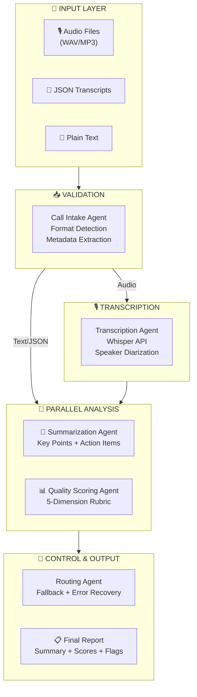
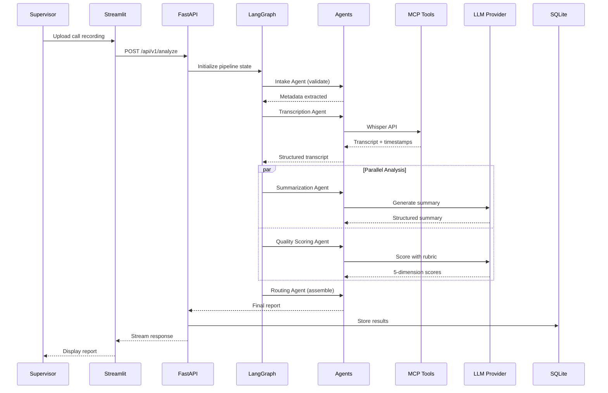
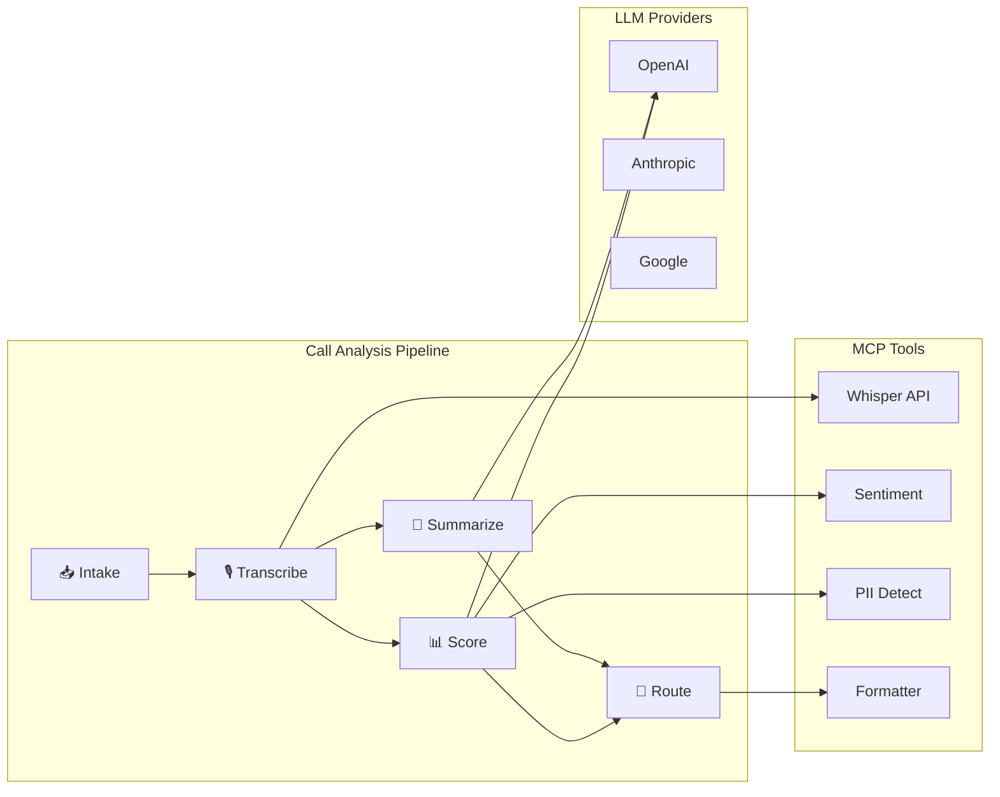

# Clarity CX — Architecture Documentation

> **Version:** 1.0.0  
> **Last Updated:** February 22, 2026

---

## Backend Architecture

The Clarity CX backend follows a layered pipeline architecture with clear separation of concerns.

### Layers

| Layer | Components | Purpose |
|-------|------------|---------|
| **Input Layer** | Audio Upload, Transcript Upload, Text Paste | Entry points for call data |
| **API Gateway** | FastAPI (Port 8000) | REST endpoints, file handling |
| **Orchestration** | LangGraph, State Machine, MCP Client | Pipeline orchestration, tool coordination |
| **Agent Layer** | 5 specialized agents | Sequential + parallel processing |
| **MCP Tools** | Whisper, Sentiment, PII Detector, Formatter | External integrations |
| **Storage** | SQLite, ChromaDB | Persistence layer |
| **Observability** | Arize Phoenix | Tracing and monitoring (localhost:6006) |
| **AI Services** | OpenAI, Anthropic, Google | Multi-provider LLM support |

---

## Pipeline Architecture

---

## Frontend Architecture

The Clarity CX frontend is built with Streamlit for rapid development and responsive design.

### Layers

| Layer | Components | Purpose |
|-------|------------|---------|
| **User Layer** | Desktop, Mobile browsers | Cross-platform access |
| **Navigation** | Streamlit Tabs | Tab-based 5-section layout |
| **Pages** | Dashboard, Analyze, History, Trends, Settings | Feature screens |
| **Components** | Score Cards, Charts, Transcript Viewer | Reusable UI elements |
| **State** | Session State | User settings, analysis cache |
| **Services** | HTTP Client, File Upload | Backend communication |

---

## Data Flow

---

## Agent Interaction Diagram

---

## Technology Stack Summary

| Category | Technology |
|----------|------------|
| Frontend | Streamlit, Plotly, Custom CSS |
| Backend | FastAPI, LangGraph, MCP |
| LLMs | Gemini 2.0 Flash, GPT-4o, Claude |
| Agents | 5 specialists (Intake, Transcription, Summarization, Quality Scoring, Routing) |
| Transcription | OpenAI Whisper |
| Databases | SQLite (records), ChromaDB (vectors) |
| Structured Output | Pydantic v2 |
| Observability | Arize Phoenix |
| Evaluations | DeepEval (Relevance, Faithfulness, Hallucination) |
| Deployment | Google Cloud Run, Docker |

---

*See [SPEC_DEV.md](../SPEC_DEV.md) for complete technical specifications.*
