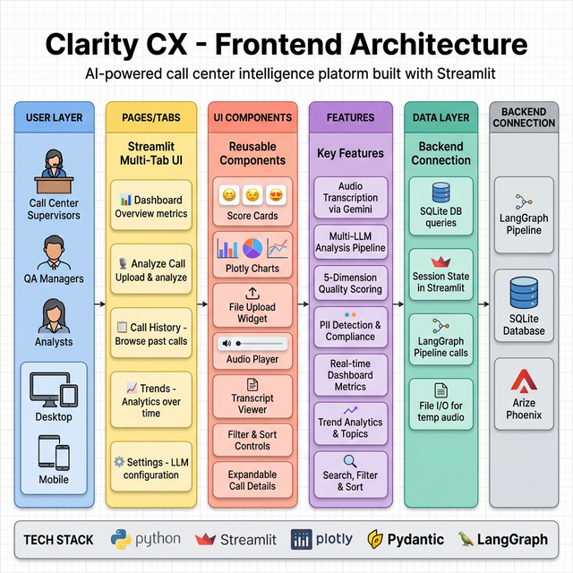
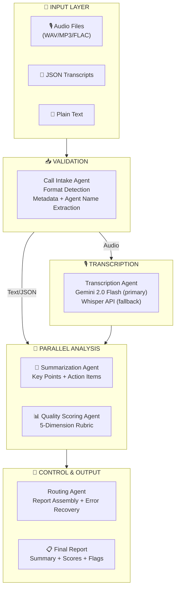
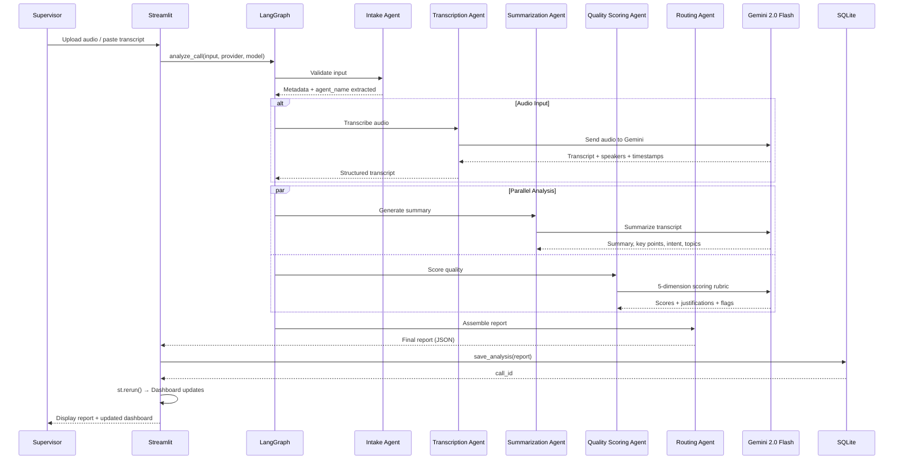
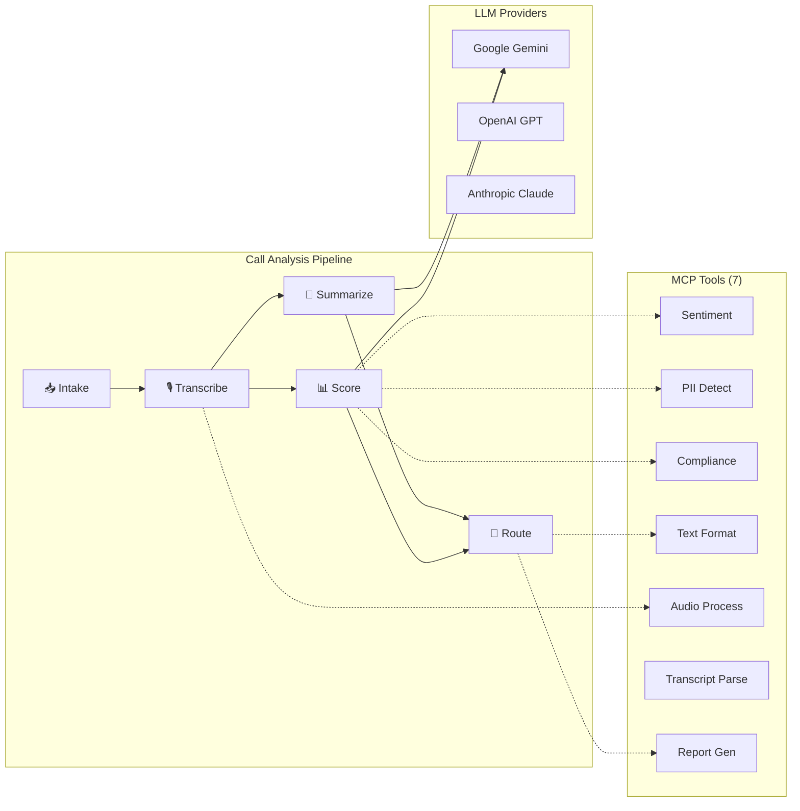

# Clarity CX — Architecture Documentation

> **Version:** 2.0.0
> **Last Updated:** March 9, 2026

---

## Backend Architecture

The Clarity CX backend follows a layered pipeline architecture with clear separation of concerns.

### Layers

| Layer | Components | Purpose |
|-------|------------|------------|
| **Input Layer** | Audio Upload, Transcript Upload, Text Paste | Entry points for call data |
| **Orchestration** | LangGraph StateGraph, Pipeline State Machine | Sequential + parallel agent execution |
| **Agent Layer** | 5 specialized agents | Process, analyze, and score calls |
| **AI Services** | Gemini 2.0 Flash, GPT-4o, Claude | Multi-provider LLM support |
| **MCP Tools** | 7 tools: Sentiment, PII, Compliance, etc. | Modular tool integrations |
| **Storage** | SQLite (`clarity_cx.db`) | Call records, analyses, quality scores |
| **Observability** | Arize Phoenix + OpenTelemetry | Tracing and LLM evaluations |
| **API Gateway** | FastAPI (Port 8000) | REST endpoints for external access |

---

## Frontend Architecture

The Clarity CX frontend is built with Streamlit for rapid development and responsive design.

### Layers

| Layer | Components | Purpose |
|-------|------------|------------|
| **User Layer** | Supervisors, QA Managers, Analysts | Cross-platform browser access |
| **Pages/Tabs** | Dashboard, Analyze, History, Trends, Settings | 5-tab navigation |
| **Components** | Score Cards, Plotly Charts, Transcript Viewer | Reusable UI elements |
| **Features** | Audio Transcription, Quality Scoring, PII Detection | Core capabilities |
| **Data Layer** | SQLite queries, Session State, LangGraph calls | Backend communication |

---

## Pipeline Architecture

---

## Data Flow (Sequence Diagram)

---

## Agent Interaction Diagram

---

## Technology Stack

| Category | Technology |
|----------|------------|
| **Frontend** | Streamlit, Plotly, Custom CSS |
| **Backend** | FastAPI, LangGraph, MCP |
| **Primary LLM** | Gemini 2.0 Flash (transcription + analysis) |
| **Additional LLMs** | GPT-4o, GPT-4o-mini, Claude Sonnet, Claude Haiku |
| **Agents** | 5 specialists (Intake, Transcription, Summarization, Quality Scoring, Routing) |
| **Transcription** | Gemini 2.0 Flash (primary), OpenAI Whisper (fallback) |
| **MCP Tools** | 7 tools (Sentiment, PII, Compliance, Format, Audio, Parse, Report) |
| **Database** | SQLite (call records, analyses, quality scores) |
| **Structured Output** | Pydantic v2 |
| **Observability** | Arize Phoenix + OpenTelemetry |
| **Evaluations** | Phoenix LLM-as-Judge (5 metrics) |
| **Testing** | pytest (26 tests) |
| **Deployment** | Google Cloud Run, Docker |

---

*See [CODE_WALKTHROUGH.md](./CODE_WALKTHROUGH.md) for detailed module documentation.*
*See [DEPLOYMENT.md](./DEPLOYMENT.md) for cloud deployment instructions.*
